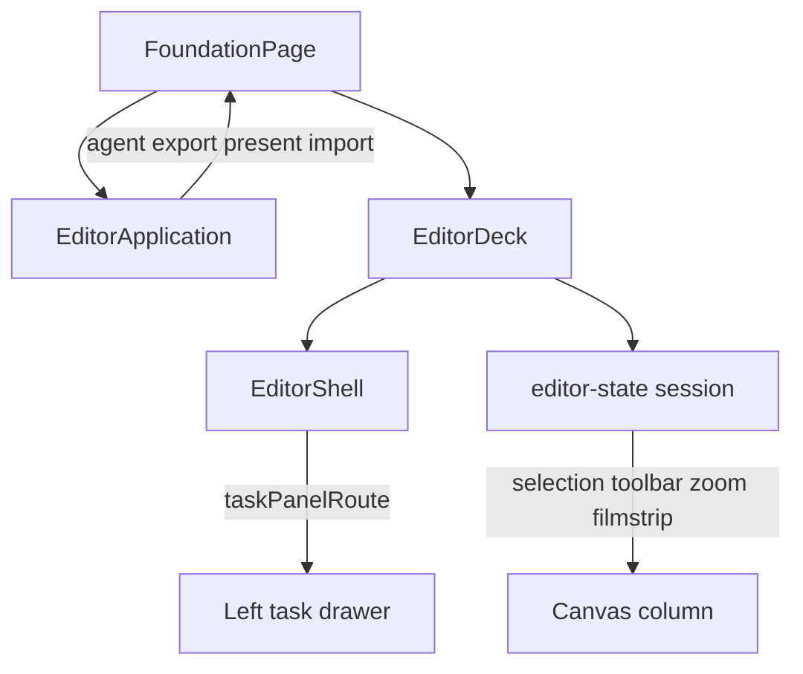

# Mona UI architecture

Structural map of how Mona’s UI is composed, owned, styled, and locked by tests. This is not a redesign brief and not a styling policy.

See also:

- [`doc/UI_SYSTEM.md`](UI_SYSTEM.md) — chrome vs geometry rules, tokens, shadcn usage
- [`doc/EDITOR_EXPERIENCE.md`](EDITOR_EXPERIENCE.md) — disclosure behavior and interaction gates
- [`doc/I18N.md`](I18N.md) — locale catalogs for chrome labels

## Entry and runtime branch

[`apps/web/src/features/foundation/FoundationPage.tsx`](../apps/web/src/features/foundation/FoundationPage.tsx) creates one [`EditorRuntime`](../apps/web/src/features/editor/editor-runtime.ts) and wraps the session in `EditorApplicationProvider`.

| Branch | When | Surface |
| --- | --- | --- |
| Mobile | Mobile UA (`isMobileUserAgent`) | Lazy `MobileView` |
| Desktop editor | Default | `EditorDeck` inside an `Activity` that hides while presenting |
| Present / audience | `presenting` or `?mode=audience` | Lazy `ScreenView` |

App-level overlays on the foundation page (not inside `EditorDeck`):

- Import fullscreen spin (`EditorFullscreenSpin`) while `importing`
- Lazy export stack (`EditorExportFeature` → `EditorExportDialog`) when `exportType` is set
- `EditorNotificationViewport` for toasts
- Dev-only `window.__MONA_TEST__` bridge for store/history/rich-text in tests

## Desktop composition tree

```
FoundationPage
  └─ EditorApplicationProvider
       ├─ EditorDeck (+ EditorShellProvider)
       │    ├─ EditorHeader
       │    └─ SidebarProvider (.mona-editor-workspace)
       │         ├─ EditorRail (creation rail)
       │         ├─ CollapsiblePanelRegion (.mona-drawer-region)
       │         │    └─ EditorRailDrawer (task panel)
       │         ├─ SidebarInset (#mona-editor-surface)
       │         │    ├─ EditorContextToolbar
       │         │    ├─ EditorCanvas | EditorPageGrid
       │         │    ├─ EditorThumbnails (filmstrip)
       │         │    └─ EditorStatusBar
       │         └─ CollapsiblePanelRegion (.mona-dock-region)
       │              └─ EditorAgentDock
       ├─ [importing] EditorFullscreenSpin
       ├─ [export] EditorExportFeature
       └─ [presenting] ScreenView
```

Primary files:

| Region | File |
| --- | --- |
| Deck shell | [`EditorDeck.tsx`](../apps/web/src/features/editor/EditorDeck.tsx) |
| Shell provider | [`shell/EditorShellProvider.tsx`](../apps/web/src/features/editor/shell/EditorShellProvider.tsx) |
| Header | [`EditorHeader.tsx`](../apps/web/src/features/editor/EditorHeader.tsx) |
| Rail | [`EditorRailNavigation.tsx`](../apps/web/src/features/editor/EditorRailNavigation.tsx) |
| Drawer content | [`EditorRail.tsx`](../apps/web/src/features/editor/EditorRail.tsx) |
| Contextual toolbar | [`EditorContextToolbar.tsx`](../apps/web/src/features/editor/EditorContextToolbar.tsx) + [`contextual/`](../apps/web/src/features/editor/contextual/) |
| Stage | [`EditorCanvas.tsx`](../apps/web/src/features/editor/EditorCanvas.tsx) |
| Page grid | [`EditorPageGrid.tsx`](../apps/web/src/features/editor/EditorPageGrid.tsx) |
| Filmstrip | [`EditorThumbnails.tsx`](../apps/web/src/features/editor/EditorThumbnails.tsx) |
| Status bar | [`EditorStatusBar.tsx`](../apps/web/src/features/editor/EditorStatusBar.tsx) |
| Agent dock | [`EditorAgentDock.tsx`](../apps/web/src/features/editor/EditorAgentDock.tsx) |
| Hotkeys sheet | [`EditorHotkeyDrawer.tsx`](../apps/web/src/features/editor/EditorHotkeyDrawer.tsx) (mounted from header) |

### Task panel routes

`EditorTaskPanelRoute` in [`shell/editor-shell.ts`](../apps/web/src/features/editor/shell/editor-shell.ts):

| Kind | Routes |
| --- | --- |
| Creation | `design`, `elements`, `text`, `uploads` |
| Secondary | `speakerNotes`, `comments`, `search`, `layers`, `semantics` |
| Properties | `properties` (inspector tabs + style / position / animation / slide design panels) |

Deck-local modals (path / latex / chart data editors) sit beside the shell and are not task-panel routes.



## Three state owners

Do not collapse these casually. Each owns a different UI concern.

### EditorApplication

[`services/editor-application.ts`](../apps/web/src/features/editor/services/editor-application.ts), implemented by `FoundationPage` via [`EditorApplicationProvider`](../apps/web/src/features/editor/services/EditorApplicationProvider.tsx).

| Owns | UI effect |
| --- | --- |
| `agentOpen` / `openAgent` / `closeAgent` | Right dock mount + focus restore |
| `exportType` / `openExport` / `closeExport` | Lazy export modal at page level |
| `presenting` / `startPresentation` / `exitPresentation` | Hide editor `Activity`, mount `ScreenView`, fullscreen, close agent/export |
| `importFiles` / `importing` | Fullscreen import spin |
| `persistence` | Header save / restore plumbing |
| `notifications` | Toast viewport |

Does **not** own drawer route, selection, or canvas zoom.

### EditorShell

[`shell/editor-shell.ts`](../apps/web/src/features/editor/shell/editor-shell.ts) + [`EditorShellProvider.tsx`](../apps/web/src/features/editor/shell/EditorShellProvider.tsx).

| Owns | UI effect |
| --- | --- |
| `taskPanelRoute` | Which left drawer is open |
| `openTaskPanel` / `toggleTaskPanel` / `closeTaskPanel` | Drawer open/close + return-focus via `[data-task-panel-route]` |

`EditorDeck` derives `drawerOpen = Boolean(railPanel)` and animates `.mona-panel-region`.

### editor-state session

[`packages/editor-state/src/index.ts`](../packages/editor-state/src/index.ts), store on [`EditorRuntime`](../apps/web/src/features/editor/editor-runtime.ts).

| Session fields | UI effect |
| --- | --- |
| `activeElementIds`, `handleElementId`, `activeGroupElementId`, `pageSelected` | Contextual capabilities + inspector target |
| `toolbarState` | Properties drawer tab |
| `drawingMode`, `creatingCustomShape`, `activeTool` | Rail highlight, create/draw modes |
| `workspaceMode` (`canvas` \| `page-grid`) | Stage vs page grid |
| `filmstripVisible` | Thumbnails row |
| `canvasZoom` / `canvasPan` / focus flags | Viewport + focus routing |
| `showRuler`, `gridLineSize`, `cropElementId`, `editingTextElementId` | Stage overlays / edit modes |
| `disableHotkeys` | Hotkey gating |

**Deck-local UI** (create tool, chart/latex/path modal targets, drawing store, sketch→agent handoff) is neither Application nor Shell nor session fields above. Presentation mutations go through `runtime.commit` / history.

## Styling ownership (current truth)

Policy lives in [`UI_SYSTEM.md`](UI_SYSTEM.md). Ownership banner for geometry CSS: top of [`editor.css`](../apps/web/src/features/editor/editor.css).

### Migrated chrome (Tailwind + `ui/*`)

| Surface | Pattern |
| --- | --- |
| Header | Tailwind on `EditorHeader`; `Button` `header-pill` / `header-icon` |
| Rail | shadcn `Sidebar*` + Tailwind; hook class `mona-editor-rail` |
| Drawer shell | Tailwind width/border; collapse via `ui/button` |
| Status bar | Tailwind + [`editor-statusbar-chrome.ts`](../apps/web/src/features/editor/editor-statusbar-chrome.ts) |
| Agent dock skin | Mostly Tailwind; layout/width still CSS (`.mona-agent-dock`, dock region) |
| Contextual **pill shell** | Tailwind on toolbar group |
| Inspector layout recipes | Helpers in `EditorInspectorPrimitives.tsx` (transitional) |

Shared control registry: [`apps/web/src/components/ui`](../apps/web/src/components/ui). Mona density extensions live as CVA variants (for example `Button` `variant="editor"` / `size="editor"`).

### Still `editor.css` / `mona-*`

| Area | Notes |
| --- | --- |
| Contextual **control** skins | Shell migrated; control dots, selects, border panels still CSS |
| Filmstrip | Geometry + tile language in CSS; some labels/flags use Tailwind in TSX |
| Panel region animation | `.mona-panel-region` width transition (geometry contract) |
| Canvas / selection | Stage, viewport, handles, live region `.mona-editor-status` |
| Residual `mona-panel-*` | Still referenced from style panels + inspector primitives |
| Animation pool | Dense `.mona-animation-pool-*` skin (inspector / style-panel pass) |

### Document paint vs feature shells

| Layer | File | Scope |
| --- | --- | --- |
| Document paint | [`presentation-renderer/renderer.css`](../apps/web/src/features/presentation-renderer/renderer.css) | Slide/element look; never import `ui/*` into paint |
| Desktop geometry | [`editor/editor.css`](../apps/web/src/features/editor/editor.css) | Direct-manipulation + residual chrome skins |
| Mobile shell | [`mobile/mobile.css`](../apps/web/src/features/mobile/mobile.css) | `.mona-mobile*` |
| Screen shell | [`screen/screen.css`](../apps/web/src/features/screen/screen.css) | `.mona-screen*` |

`apps/web/src/index.css` imports `renderer.css` then `editor.css` globally. Mobile/screen CSS are feature-owned imports.

## Shared presentation paint

Pipeline (no application chrome):

1. [`ScaledSlide.tsx`](../apps/web/src/features/presentation-renderer/ScaledSlide.tsx) — fit-to-frame
2. [`SlideRenderer.tsx`](../apps/web/src/features/presentation-renderer/SlideRenderer.tsx) — render graph → layered elements
3. [`ElementRenderer.tsx`](../apps/web/src/features/presentation-renderer/ElementRenderer.tsx) + [`elements/`](../apps/web/src/features/presentation-renderer/elements/)

Helpers: [`render-utils.ts`](../apps/web/src/features/presentation-renderer/render-utils.ts), [`chart-options.ts`](../apps/web/src/features/presentation-renderer/chart-options.ts). Read-only deck shell: [`ReadOnlyDeck.tsx`](../apps/web/src/features/presentation-renderer/ReadOnlyDeck.tsx).

Consumers: editor canvas and thumbnails, export, agent slide preview, mobile preview/player, screen playback and presenter strips.

## Mobile and screen surfaces

Both reuse the same `EditorRuntime` from `FoundationPage`.

### Mobile ([`features/mobile/`](../apps/web/src/features/mobile/))

| File | Role |
| --- | --- |
| `MobileView.tsx` | Modes: `preview` \| `editor` \| `player` |
| `MobileEditor.tsx` | Embeds desktop `EditorCanvas` without desktop chrome |
| `MobilePreview.tsx` / `MobilePlayer.tsx` | List / playback via `ScaledSlide` |
| `MobileThumbnails.tsx` / `MobileElementToolbar.tsx` | Navigation and selection chrome |

Thin wrappers over `Button` / `ButtonGroup` in `MobilePrimitives.tsx`.

### Screen ([`features/screen/`](../apps/web/src/features/screen/))

| File | Role |
| --- | --- |
| `ScreenView.tsx` | Entry, fullscreen, presenter vs audience, sync channel |
| `ScreenViews.tsx` | Base / presenter toolbars |
| `ScreenSlideList.tsx` | Live playback stack (`ElementRenderer` + turning modes) |
| `ScreenThumbnails.tsx` | Bottom strip / all-slides / presenter strip |
| `use-screen-playback.ts` | Advance, animations, autoplay, laser, keyboard |

Audience windows sync over a broadcast channel; they are not a second editor store.

## Key interaction flows

### Open rail / task panel

1. Rail item with `data-task-panel-route` → `changeRailPanel` → `openTaskPanel(route)` (clears drawing mode).
2. `CollapsiblePanelRegion` opens; drawer shows creation or secondary content.
3. Escape / Collapse panel → `closeTaskPanel` (restores focus to rail trigger).
4. Selecting elements while on a creation route auto-closes that panel.

### Open properties inspector

1. Contextual deep action or inspector tab → `openContextualInspector(toolbarState)` in `EditorDeck`.
2. Dispatches `toolbarStateChanged` + `openTaskPanel('properties')`.
3. Drawer shows tabs + matching style / position / animation / slide design panel from selection.

### Contextual toolbar

1. Selection → [`resolve-selection-capabilities.ts`](../apps/web/src/features/editor/contextual/resolve-selection-capabilities.ts).
2. Controls from [`contextual-control-registry.tsx`](../apps/web/src/features/editor/contextual/contextual-control-registry.tsx) and type modules.
3. Frequent edits mutate via runtime/rich text; deep actions open the properties drawer.
4. Hidden when selection kind is empty. Focus entry: Ctrl/Meta+F1 into the toolbar.

### Agent dock

1. Header AI control → `openAgent()` / `closeAgent()`.
2. Foundation sets `agentOpen`; deck mounts dock in the right `CollapsiblePanelRegion`.
3. Present start, sketch handoff, or close dismisses; focus restored outside `.mona-agent-dock`.

### Present mode

1. Header / status bar / filmstrip → `startPresentation({ fromStart, viewMode?, autoPlay? })`.
2. Closes export + agent; optional jump to first visible slide; fullscreen; `presenting = true`.
3. Editor `Activity` hidden (state preserved); `ScreenView` mounts.
4. Exit → `exitPresentation`; focus restored to the pre-present control.

## Test and a11y locks

| Hook | Role |
| --- | --- |
| `data-testid="editor-deck"` | Deck root |
| `data-testid="mona-editor-surface"` + `id="mona-editor-surface"` | Canvas column |
| `id="mona-editor-canvas"` + role `application` | Primary ready / focus gate |
| Skip link to `#mona-editor-canvas` | Header a11y |
| `role="navigation"` name **Editor tools** | Creation rail |
| `data-task-panel-route` on rail buttons | Focus restore |
| `.mona-editor-drawer` + complementary landmark | Drawer presence |
| Contextual `role="toolbar"`, `data-selection-kind`, `data-contextual-mode` | Capability / crop flows |
| `.mona-thumbnail-rail` / `.mona-editor-filmstrip` | Filmstrip focus |
| `.mona-agent-dock`, complementary **Mona AI** | Agent dock |
| `.mona-editor-status` | Live selection announcements |
| `.mona-editor-slide-canvas`, `[data-element-id]`, `data-testid="selection-frame"` | Hit targets |
| `window.__MONA_TEST__` (dev) | Store bridge |

Primary lock files:

- [`EditorDeck.browser.test.tsx`](../apps/web/src/features/editor/EditorDeck.browser.test.tsx)
- [`contextual/EditorContextToolbar.browser.test.tsx`](../apps/web/src/features/editor/contextual/EditorContextToolbar.browser.test.tsx)
- [`e2e/accessibility.spec.ts`](../apps/web/e2e/accessibility.spec.ts)
- [`e2e/editor-interactions.spec.ts`](../apps/web/e2e/editor-interactions.spec.ts)

Architecture boundary check: `npm run check:architecture` (see [`UI_SYSTEM.md`](UI_SYSTEM.md)).

## i18n surfaces for chrome

| Catalog | Typical chrome |
| --- | --- |
| `foundation.*` ([`i18n/foundation/`](../apps/web/src/i18n/foundation/)) | Desktop rail, status bar, contextual, drawer titles |
| `shared` ([`i18n/shared/`](../apps/web/src/i18n/shared/)) | `header.*`, `toolbar.*`, `hotkeys.*`, `screen.*`, `mobile.*`, `timer.*`, `drawingTools.*`, `runtime.*`, `player.*` |

## Remaining simplification backlog

Inventory only — not work owned by this document. Same look, simpler code (Tailwind + native shadcn), no redesign.

Task-panel content chrome is settled: the shared panel kit in
[`panel/EditorPanelPrimitives.tsx`](../apps/web/src/features/editor/panel/EditorPanelPrimitives.tsx)
(`PanelChrome`/`PanelHeader`/`PanelBody`, `PanelSearchField`, `PanelBackHeader`,
`PanelSectionHeader`, `PanelEmptyState`/`PanelLoadingRow`/`PanelErrorRow`,
`PanelMasonry`) is the canonical construction path for drawer panels — new
panels compose these primitives instead of hand-rolling search shells, back
rows, section headers, empty states, or grids. Underline tabs use
`Tabs variant="line"`; chips use `Button size="chip"`; trailing search-shell
icon buttons use `Button size="header-icon"`.

Settled in the export / pools pass:

- Hotkey drawer is `Sheet` + Tailwind (`EditorHotkeyDrawer`)
- Export dialog chrome is Tailwind + shadcn (`EditorExportDialog`); no `.mona-export-*` skin
- Creation pools (element category tiles, shape/line grids) and templates/symbols compose Tailwind in `EditorRail` / panel kit — charts already use `EditorChartsPanel`

Preferred order for the remaining chrome pass:

1. Contextual toolbar **control** skins (keep absolute geometry)
2. Filmstrip tile chrome (keep drag/drop/mask geometry)
3. Retire residual `mona-panel-*` from style panels / `EditorInspectorPrimitives`
4. Style-panel / inspector density + modal policy unification (`EditorModal` vs raw Dialogs vs Sheet)
5. Animation pool dense `.mona-animation-pool-*` skin

Geometry that must stay in CSS: stage/viewport, selection and transform/crop handles, filmstrip drag markers and edge masks, `CollapsiblePanelRegion` width animation, color-picker pointers, rich-text document surface.
